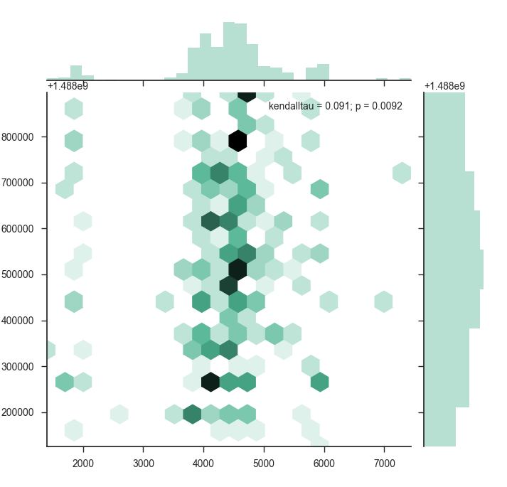
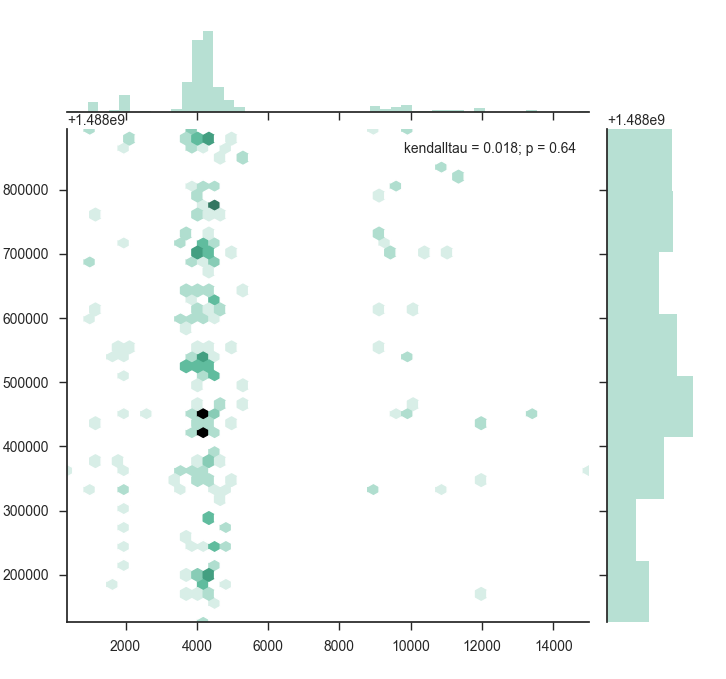

### single process synchronous spider demo for taobao(tmall included)

requirements:

- Python3.5
- selenium with chromedriver handles all ajax requests and page events
- seaborn(numpy, scipy) counts and paints the plot
- mongoDB acts as a store engine

因为以下等原因使用了 selenium（或许研究一下 ajax 的 query 是可以用不同的网络请求搞定的)：

- 翻页全部通过 ajax 请求取回数据
- 历史交易页翻页验证登录 cookies
- 登录滑块验证
- 登录后手机验证

搜索商品页 -> 商品列表页 -> 店铺主页 -> 店铺评价页 -> 历史交易

### demo.py

demo.py file shows how to get last week's transaction history for specific item.

- name
- actual_name
- actual_category
- category
- price
- date
- shop_name
